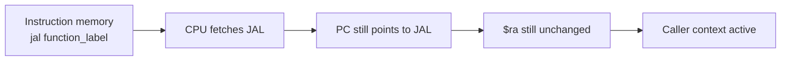
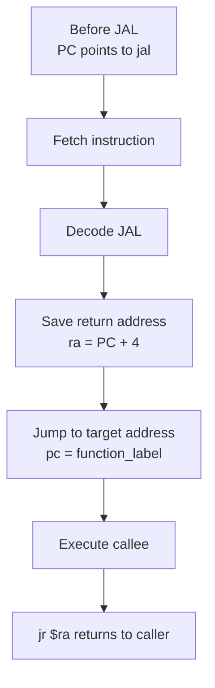

# MIPS JAL RARS Flow

## Instruction

```asm
jal function_label
```

## Meaning

`JAL` means **Jump And Link**.

It performs two actions:

1. Saves the return address into `$ra`.
2. Jumps to the target label.

## Before JAL

This is the state the system has before the instruction executes:

```text
CPU context:
PC  -> points at jal function_label
$ra -> still contains the previous return address, or 0 at startup

Control context:
The caller is active
The callee has not started yet
The return address has not been linked yet
```

The CPU is still in the caller context. Nothing has jumped yet.



## Flow

```text
Current PC
→ Fetch jal function_label
→ Decode JAL
→ $ra = PC + 4
→ PC = address(function_label)
→ Execute function
→ jr $ra returns to saved address
```



## Example

```asm
main:
    jal hello
    li $v0, 10
    syscall

hello:
    li $v0, 1
    li $a0, 123
    syscall
    jr $ra
```

## Visual Register Transition

```text
Before JAL:
PC = 0x00400000
$ra = 0x00000000

After JAL:
PC = address(hello)
$ra = 0x00400004
```
